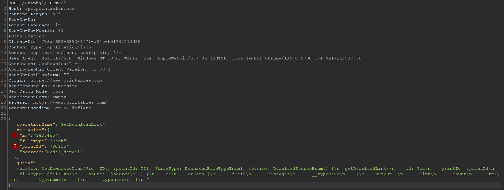

# Printables.com Downloads

This is a download booster specifically designed for 3D models on printables.com. It enhances the count of downloads for a 3D model by utilizing the ZenRow rotation proxy to simulate multiple users downloading the model.

## How it works

Printables.com displays the number of downloads for each 3D model. This script automates the process of increasing the download count by simulating multiple users downloading the model through the ZenRow rotation proxy. By doing so, it boosts the perceived popularity of the model on the website.

## Installation

1. Clone this repository to your local machine using `git clone https://github.com/zyeb/printables-downloads.git`.
2. Navigate to the project directory.
3. Install the required dependencies by running `pip install -r requirements.txt`.

## Usage

1. Run the `printables.py` script.
2. Enter the number of download requests you want to send when prompted.
3. Intercept the POST request to GraphQL to obtain the ID and printId of the 3D print model you wish to boost the download count for.
4. Enter the obtained ID and printId when prompted.
5. The script will start simulating multiple users downloading the model through the ZenRow rotation proxy.
6. After completion, the download count for the specified 3D model on printables.com will be increased.

## Requirements

You will need an API key for the ZenRow rotation proxy service.

## Request Example

## Disclaimer

This project is intended for educational purposes only. Use it responsibly and ensure compliance with the terms of service of printables.com. I am not responsible for any misuse of this software.
